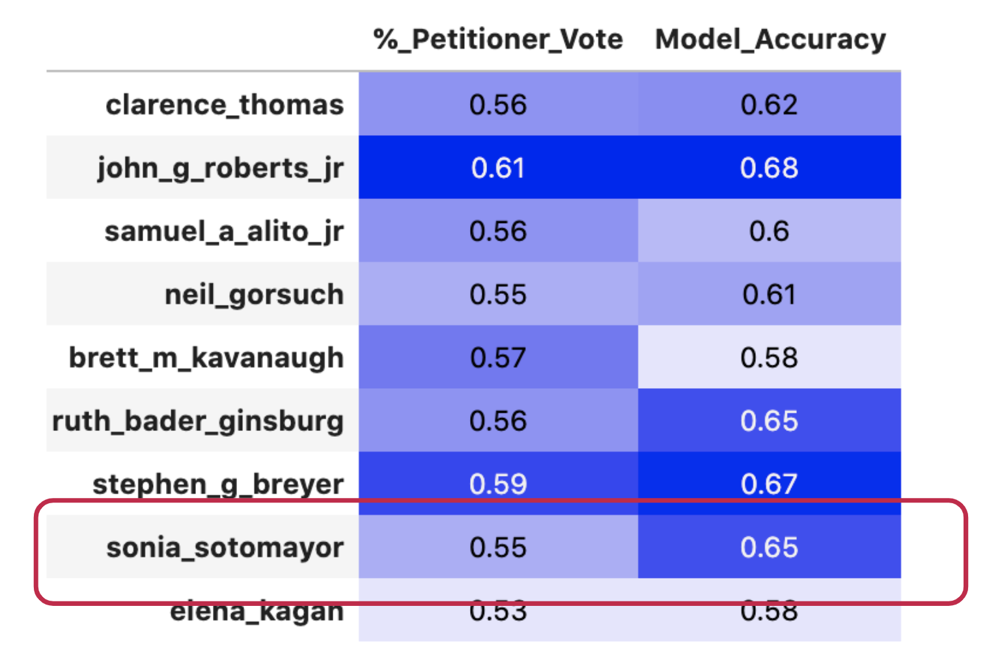
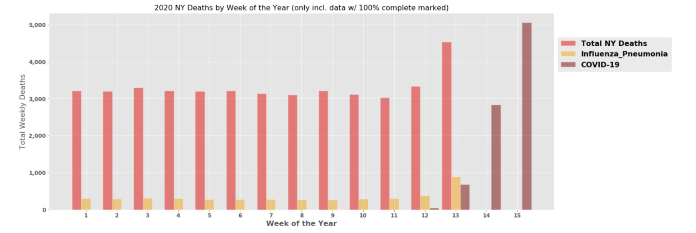
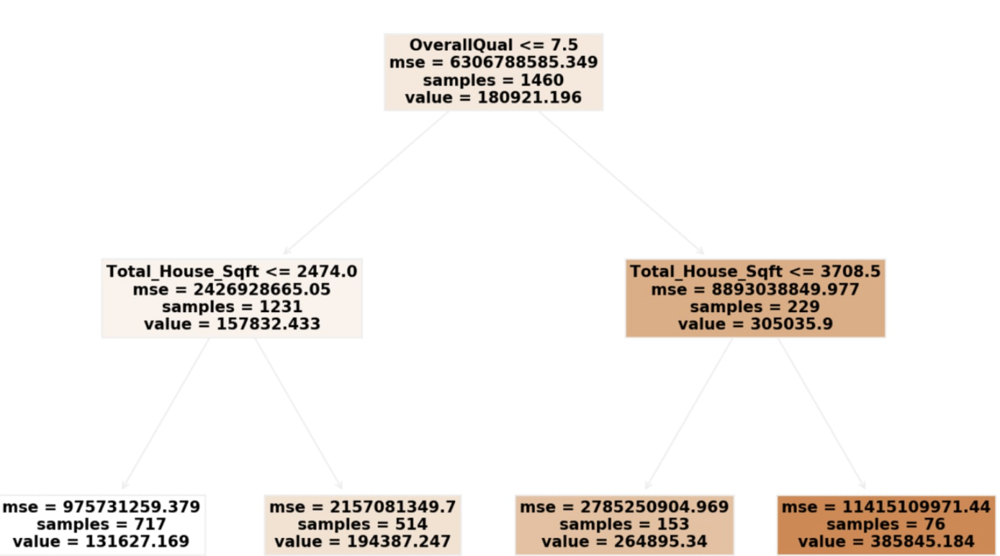

# My Portfolio
An overview of my personal Data Science projects are shown below. The Github repo links which explain the full project are included.

### Predicting Supreme Court Case Outcomes using transcribed Oral Arguments
This project focuses on the most visible component we have as onlookers into the Supreme Court: Oral Arguments. The contents of this project parse the transcriptions of oral arguments into numerical features to see if they add to one's ability to predict the winning side of a Supreme Court case.

- [GitHub repo](https://github.com/jdybuncio/data-science-and-the-supreme-court)

Technologies used:
Python, Pandas, Json, Scikit-learn, Matplotlib, and Tensorflow

---
### Predicting Student Outcomes in Virtual Learning Environment
Due to the rapid shift towards virtual learning brought on by COVID-19, I was interested in looking into the new possibilities given the additional data virtual learning offers to the education space. I take a dataset from the U.K.'s largest undergraduate education provider, The Open University, to create a prediction model which seeks to identify which students have the highest propensity to fail as of Day 1 of any course. I primarily investigate hypotheses related to if specific student interactions with the online platform are strong predictors for if the student passes or fails a class.

- [GitHub repo](https://github.com/jdybuncio/predicting-virtual-learning-outcomes)

Technologies used:  
Python, Scikit-learn, Pandas, Numpy, Matplotlib

---
### Using Overall Mortality numbers to better understand COVID-19
One thing I was struck by during the 2020 global pandemic was the daily reporting on both death and sickness. In an attempt to digest the COVID-19 death totals and projections at the pandemic's onset, I loaded, cleaned, and merged three datasets in order to investigate mortality in the United States.

- [GitHub repo](https://github.com/jdybuncio/usa-mortality-investigation)
- [Blog post](https://datadybuncio.substack.com/p/motd-1-us-mortality-rates)

Technologies used:  
Python, Pandas, Bayesian and classical statistics, Matplotlib

---
### Predicting Housing Prices
I joined a Kaggle competition to use a dataset from Ames, Iowa to predict the sale prices of houses. This project was my first foray into attempting to apply some of the Supervised Learning Algorithms I learned and to try to explain them to non-technical stakeholders.

- [GitHub repo](https://github.com/jdybuncio/predicting-housing-prices-Kaggle-comp)
- [Blog post](https://datadybuncio.substack.com/p/predicting-housing-prices)

Technologies used:  
Python, Pandas, Scikit-learn, Matplotlib

